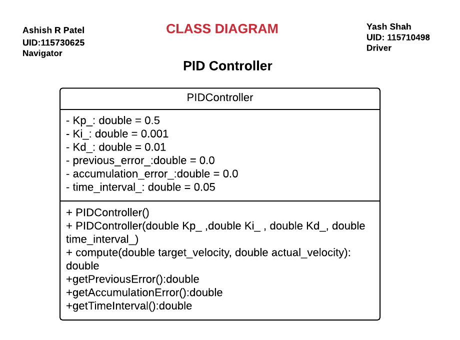
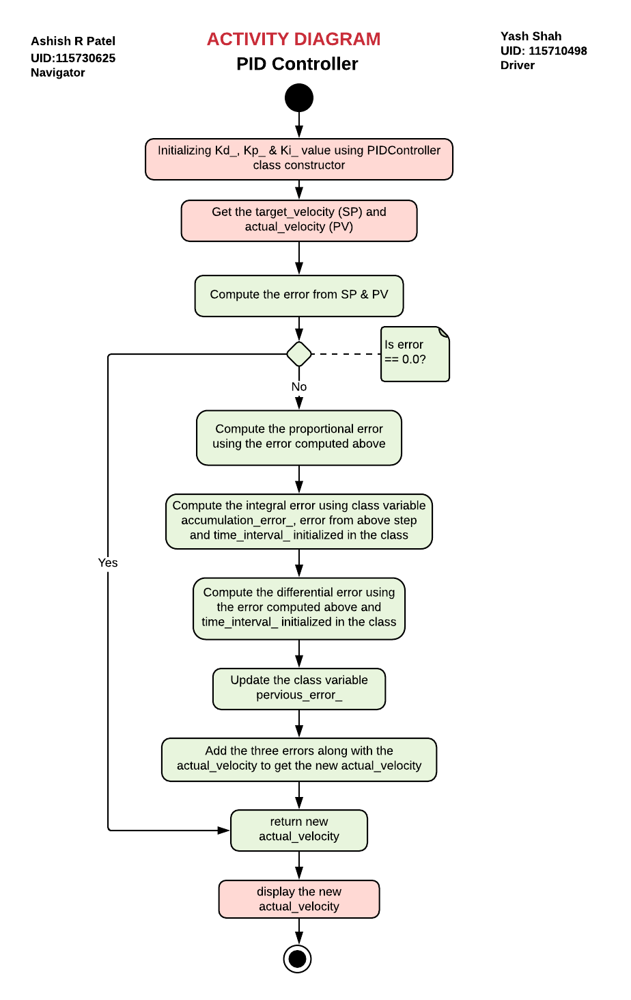

# PID Controller 
[](https://travis-ci.org/ysshah95/pid-controller)
[](https://coveralls.io/github/ysshah95/pid-controller?branch=master)
---

## Table of Contents
- [Overview](#overview)
- [Introduction to PID Controller](#intro)
- [Authors](#authors)
- [Class Diagram](#class)
- [Activity Diagram](#activity)
- [Standard install via command-line](#implementation)
- [Working with Eclipse IDE](#eclipse)

## <a name="overview"></a> Overview
This repo is developed as a part of developing new mobile robot product for ACME Robotics. It implements PID Controller functionality for a new mobile robot. The team members working to develop this project uses pair programming software development technique. The authors are listed in the author section below. 

This repository serves as a simple C++ PID controller algorithm implementation with:

- cmake
- googletest

## <a name="intro"></a> Introduction to PID controller
PID is a control loop feedback mechanism. It continuously calculates an error value as the difference between a defined setpoint (SP) and a measured process value (PV) and applies correction based on Proportional, Integral and Derivative terms. The first component of PID controller is P which stands for proportional, that means it adjusts the output proportionally to the error using Kp, proportional coefficient. It's a constant non-negative value that is determined during the tuning process of the controller. The second component of controller is I which stands for integral, in mathematical term that means the accumulation of something with respect to something else. In this case accumulation of error over time. Its has an integral coefficient Ki. The third compoent of controller is D which stands for derivative, in mathematical term that means the slope of a curve. Its has a derivative coefficient Kd. 

The above three coefficients are used in tuning a PID controller. Tuning is the process of determining the ideal values for Kp, Ki, and Kd in order to achieve the desired response.  

## <a name="authors"></a> Authors for Part 1
- **Driver:** Yash Shah (UID: 115710498) (github: ysshah95)
- **Navigator:** Ashish Patel (UID: 115730625) (github: Learner1729)

## Authors for Part 2
- **Driver:** 
- **Navigator:** 

## <a name="class"></a> Class Diagram
<p align="center">
<a target="_blank">
</a>
</p>

## <a name="activity"></a> Activity Diagram
<p align="center">
<a target="_blank">
</a>
</p>

## <a name="implementation"></a> Standard install via command-line
```
git clone --recursive https://github.com/ysshah95/pid-controller.git
cd <path to repository>
mkdir build
cd build
cmake ..
make
Run tests: ./test/cpp-test
Run program: ./app/shell-app
```

## Building for code coverage (for assignments beginning in Week 4)
```
sudo apt-get install lcov
cmake -D COVERAGE=ON -D CMAKE_BUILD_TYPE=Debug ../
make
make code_coverage
```
This generates a index.html page in the build/coverage sub-directory that can be viewed locally in a web browser.

## <a name="eclipse"></a> Working with Eclipse IDE ##

## Installation

In your Eclipse workspace directory (or create a new one), checkout the repo (and submodules)
```
mkdir -p ~/workspace
cd ~/workspace
git clone --recursive https://github.com/ysshah95/pid-controller.git
```

In your work directory, use cmake to create an Eclipse project for an [out-of-source build] of cpp-boilerplate

```
cd ~/workspace
mkdir -p boilerplate-eclipse
cd boilerplate-eclipse
cmake -G "Eclipse CDT4 - Unix Makefiles" -D CMAKE_BUILD_TYPE=Debug -D CMAKE_ECLIPSE_VERSION=4.7.0 -D CMAKE_CXX_COMPILER_ARG1=-std=c++14 ../cpp-boilerplate/
```

## Import

Open Eclipse, go to File -> Import -> General -> Existing Projects into Workspace -> 
Select "boilerplate-eclipse" directory created previously as root directory -> Finish

# Edit

Source files may be edited under the "[Source Directory]" label in the Project Explorer.


## Build

To build the project, in Eclipse, unfold boilerplate-eclipse project in Project Explorer,
unfold Build Targets, double click on "all" to build all projects.

## Run

1. In Eclipse, right click on the boilerplate-eclipse in Project Explorer,
select Run As -> Local C/C++ Application

2. Choose the binaries to run (e.g. shell-app, cpp-test for unit testing)


## Debug


1. Set breakpoint in source file (i.e. double click in the left margin on the line you want 
the program to break).

2. In Eclipse, right click on the boilerplate-eclipse in Project Explorer, select Debug As -> 
Local C/C++ Application, choose the binaries to run (e.g. shell-app).

3. If prompt to "Confirm Perspective Switch", select yes.

4. Program will break at the breakpoint you set.

5. Press Step Into (F5), Step Over (F6), Step Return (F7) to step/debug your program.

6. Right click on the variable in editor to add watch expression to watch the variable in 
debugger window.

7. Press Terminate icon to terminate debugging and press C/C++ icon to switch back to C/C++ 
perspetive view (or Windows->Perspective->Open Perspective->C/C++).


## Plugins

- CppChEclipse

    To install and run cppcheck in Eclipse

    1. In Eclipse, go to Window -> Preferences -> C/C++ -> cppcheclipse.
    Set cppcheck binary path to "/usr/bin/cppcheck".

    2. To run CPPCheck on a project, right click on the project name in the Project Explorer 
    and choose cppcheck -> Run cppcheck.


- Google C++ Sytle

    To include and use Google C++ Style formatter in Eclipse

    1. In Eclipse, go to Window -> Preferences -> C/C++ -> Code Style -> Formatter. 
    Import [eclipse-cpp-google-style][reference-id-for-eclipse-cpp-google-style] and apply.

    2. To use Google C++ style formatter, right click on the source code or folder in 
    Project Explorer and choose Source -> Format

[reference-id-for-eclipse-cpp-google-style]: https://raw.githubusercontent.com/google/styleguide/gh-pages/eclipse-cpp-google-style.xml

- Git

    It is possible to manage version control through Eclipse and the git plugin, but it typically requires creating another project. If you're interested in this, try it out yourself and contact me on Canvas.
